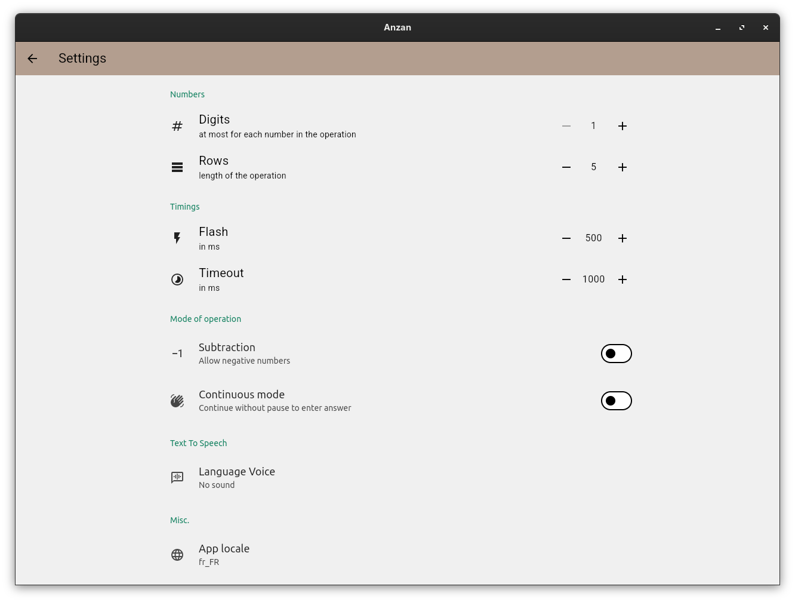

# Flash anzan

This is a rewrite in **flutter** of our previous work (called *mentalcalcultion* in *python/pyQt*).

It is cross-platform and is able to be run on Linux, Windows, web, Android.
IOS and macOS are not available because I don't own the required hardware (nothing is possible with emulators in that case).

You can practice your anzan skills i.e. mental abacus (or mental calculation if you don't wish to visualize a soroban).

## Wikipedia links
  - [Soroban](https://en.wikipedia.org/wiki/Soroban)
  - [Mental abacus](https://en.wikipedia.org/wiki/Mental_abacus)
  - [Mental calculation](https://en.wikipedia.org/wiki/Mental_calculation)

##  Description
The app flashes number and you have to provide the result of the operation (addition and/or subtraction). You are free to use or not anzan for doing the calculation of course, because this is your mental processing the operation.

You can configure various settings:

You can also use a TTS (aka. Text-To-Speach) feature to get the numbers pronounced in a selection of languages.

This is also a tool you can use to practice on a real soroban, instead of doing anzan.

TODO: we need to add multiplication and division for that purpose.

## Releases

Different prebuild binaries are available in [Releases](https://github.com/solsticedhiver/anzan/releases)
### Linux
For linux, you can use:
  - the **tarbal** *anzan-linux_x64.tar.gz*, that contains a binary build of the software.
  - the **snap** package *anzan_x.y.z_amd64.snap*. You can install it with `snap install anzan_x.y.z_amd64.snap --dangerous`. This will bypass certificate check. Look at the snap documentation for the reason of the option name (i.e. dangerous)
  - the **flatpak** *anzan-x86_64.flatpak*. You can install it with `flatpak install --user anzan-x86_64.flatpak`

### Windows
For windows, you have:
  - a zip archive *anzan-windows_x64.zip*, that contains a binary built. You can launch it by running `anzan.exe` inside the *anzan-x.y.z* directory.
  - a setup.exe *anzan-setup.exe* to install the software.

### Android
On android, you have to download and install the **apk** package for your device:
  - *anzan-armeabi-v7a.apk* for arm 32-bit machine
  - *anzan-arm64-v8a.apk* for arm 64-bit machine
  - *anzan-x86_64.apk* for x86_64 machine

### Web
This app is also available as an installable PWA (Progressive Web App) on the web at [sorobanexam.org](https://www.sorobanexam.org/anzan.app/)

### Source
You can built it yourself from source. You have to have a working *flutter* installation. You run it with `flutter run`.
