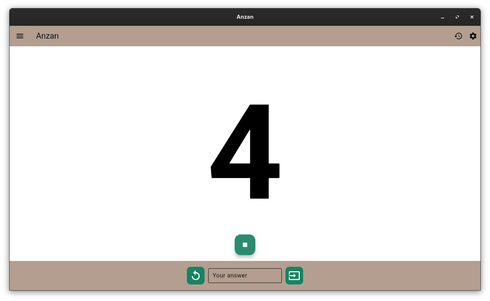

# Flash anzan

This is a rewrite in *flutter* of our previous work (called *mentalcalcultion* in **python/pyQt**).

It is cross-platform and is able to be run on Linux, Windows, web, Android.
IOs and macOs are not available because I don't own the required hardware (nothing is possible with emulators in that case).

You can pratice your anzan skills (or mental calculation if you don't wish to visualize a soroban).

You can configure the number of the digits of the numbers you have to add.

You can use a TTS (aka. Text-To-Speach) feature to get the numbers pronounced in a selection of languages.

